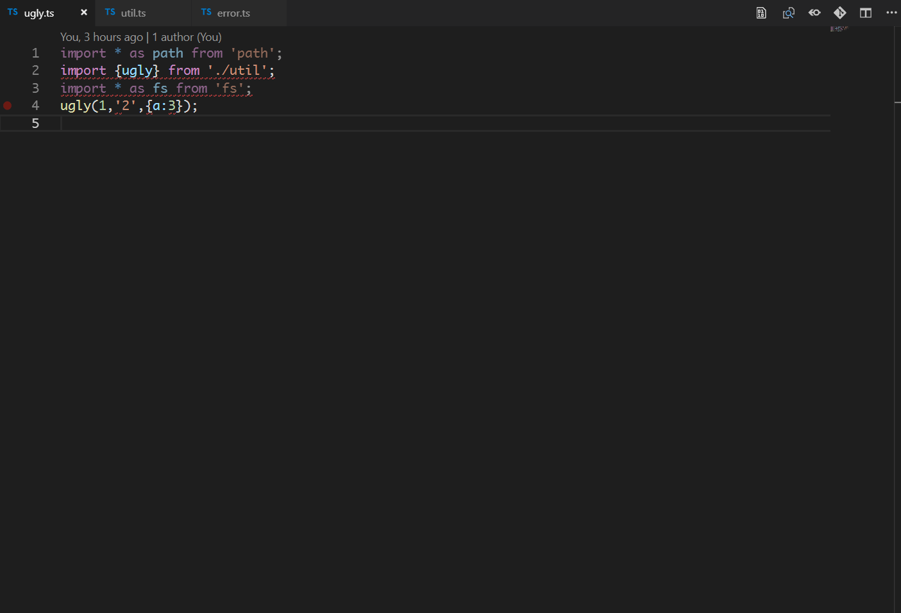

# tsfmt for Visual Studio Code
Format your TypeScript code with [tsfmt](https://github.com/vvakame/typescript-formatter).

## Requirements Resolution
This extension will use `tsfmt`, `tslint` and `typescript` modules installed closest to the formatted file. If any of the modules is not installed, a bundled version is used instead. The fallback `typescript` module is the version shipped with VSCode.

## Extension Settings
| Key | Type | Description | Default |
| --- | ---- | ----------- | ------- |
| tsfmt.tslint.autoFix | `"enabled" \| "disabled"` | Fix all auto-fixable tslint failures after formatting | `"disabled"` |

## License
This software is released under the terms of the MIT license.

## Release Notes
See [CHANGELOG.md](CHANGELOG.md) or the [Releases Page](https://github.com/EternalPhane/tsfmt-vscode/releases).
